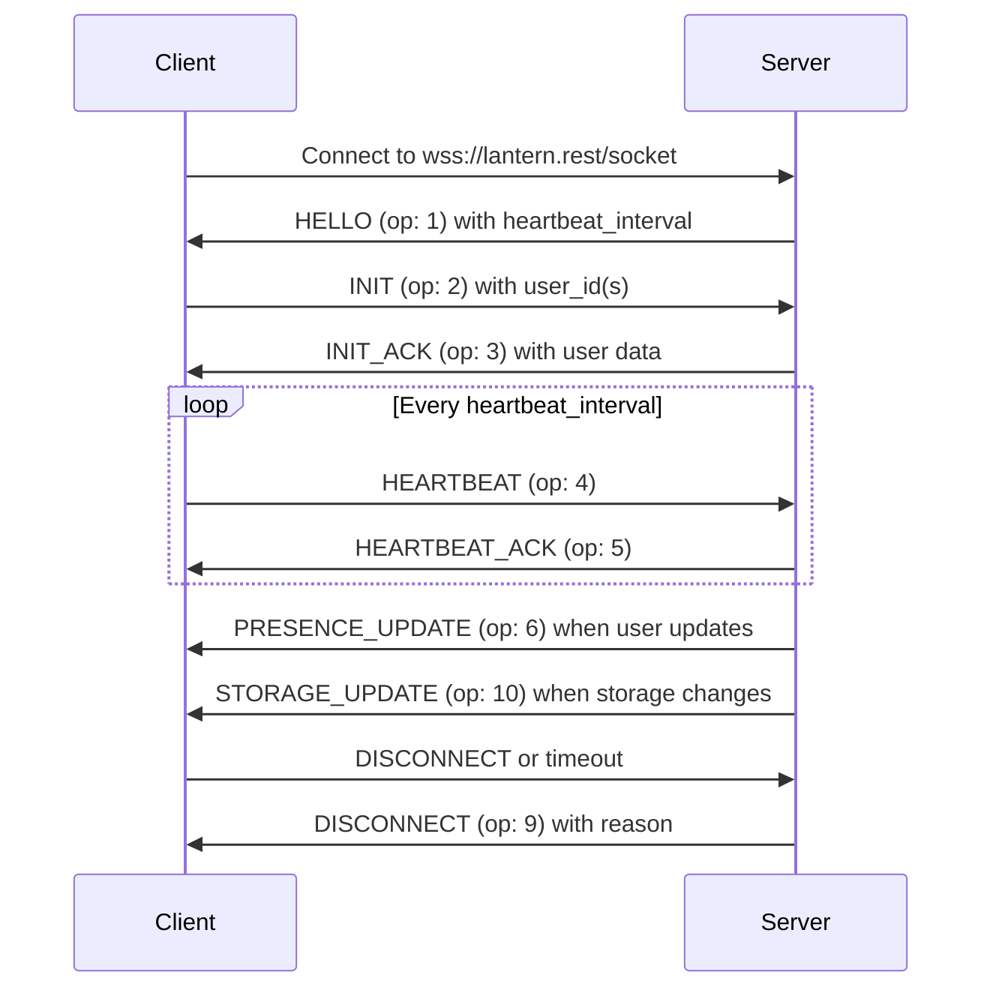

The Lantern WebSocket API provides real-time updates for Discord user presence, activities, and storage changes. Connect to receive instant notifications when monitored users update their status, start playing games, or listen to Spotify.

## Connection URL

Connect to the WebSocket server at:

```
wss://lantern.rest/socket
```

## Connection flow

Follow this sequence to establish a successful WebSocket connection:

<Steps>
  <Step title="Connect to WebSocket">
    Open a WebSocket connection to `wss://lantern.rest/socket`.
  </Step>

  <Step title="Receive HELLO">
    Upon connection, the server sends `Opcode 1: HELLO` with the heartbeat interval:

    ```json
    {
      "t": "HELLO",
      "op": 1,
      "d": {
        "heartbeat_interval": 10000
      }
    }
    ```

    The `heartbeat_interval` value (in milliseconds) determines how often you must send heartbeat messages.
  </Step>

  <Step title="Send INIT">
    Immediately after receiving HELLO, send `Opcode 2: INIT` to subscribe to user updates.

    <CodeGroup>
    ```json Single user
    {
      "op": 2,
      "d": {
        "user_id": "123456789012345678"
      }
    }
    ```

    ```json Multiple users
    {
      "op": 2,
      "d": {
        "user_ids": ["123456789012345678", "234567890123456789"]
      }
    }
    ```

    ```json All users
    {
      "op": 2,
      "d": {
        "user_id": "All"
      }
    }
    ```
    </CodeGroup>
  </Step>

  <Step title="Receive INIT_ACK">
    The server acknowledges your subscription with `Opcode 3: INIT_ACK`, containing the current data for subscribed users:

    ```json
    {
      "t": "INIT_ACK",
      "op": 3,
      "d": {
        // User data object or array of user objects
      }
    }
    ```
  </Step>

  <Step title="Start heartbeat cycle">
    Set up a repeating interval based on the `heartbeat_interval` from HELLO. Send `Opcode 4: HEARTBEAT` on this interval:

    ```json
    {
      "t": "HEARTBEAT",
      "op": 4
    }
    ```

    The server responds with `Opcode 5: HEARTBEAT_ACK` to confirm it received your heartbeat.
  </Step>
</Steps>

<Warning>
  You must send heartbeats at the specified interval. Failure to send heartbeats will result in disconnection.
</Warning>

## Subscription options

### Subscribe to a single user

Monitor one specific user by their Discord ID:

```json
{
  "op": 2,
  "d": {
    "user_id": "123456789012345678"
  }
}
```

### Subscribe to multiple users

Monitor multiple users simultaneously:

```json
{
  "op": 2,
  "d": {
    "user_ids": ["123456789012345678", "234567890123456789"]
  }
}
```

### Subscribe to all users

Receive updates for all users monitored by Lantern:

```json
{
  "op": 2,
  "d": {
    "user_id": "All"
  }
}
```

<Info>
  Use the "All" subscription option carefully, as it will send updates for every user in the Lantern server, which can be high volume.
</Info>

## Heartbeat mechanism

The heartbeat keeps your connection alive and lets the server know your client is still responsive.

<ParamField path="heartbeat_interval" type="number">
  Time in milliseconds between heartbeat messages. Provided in the HELLO opcode.
</ParamField>

### Implementation example

```javascript
let heartbeatInterval;

ws.on('message', (data) => {
  const message = JSON.parse(data);
  
  if (message.op === 1) { // HELLO
    const interval = message.d.heartbeat_interval;
    
    // Start sending heartbeats
    heartbeatInterval = setInterval(() => {
      ws.send(JSON.stringify({
        t: "HEARTBEAT",
        op: 4
      }));
    }, interval);
  }
});
```

<Warning>
  Clear the heartbeat interval when disconnecting to prevent memory leaks.
</Warning>

## Managing subscriptions

After the initial connection, you can dynamically add or remove users from your subscription.

### Add users to subscription

Send `Opcode 12: SUBSCRIBE` to add users:

```json
{
  "op": 12,
  "d": {
    "user_id": "345678901234567890"
  }
}
```

The server responds with `Opcode 13: SUBSCRIBE_ACK` to confirm.

### Remove users from subscription

Send `Opcode 14: UNSUBSCRIBE` to remove users:

```json
{
  "op": 14,
  "d": {
    "user_id": "123456789012345678"
  }
}
```

The server responds with `Opcode 15: UNSUBSCRIBE_ACK` to confirm.

<Warning>
  If you unsubscribe from all users, the server will send `Opcode 9: DISCONNECT` and close the connection.
</Warning>

## Receiving updates

Once connected and subscribed, you'll receive real-time events:

### Presence updates

When a subscribed user updates their Discord presence (status, activity, Spotify track):

```json
{
  "t": "PRESENCE_UPDATE",
  "op": 6,
  "d": {
    // Updated user data
  }
}
```

### User joined

When a new user joins the Lantern server:

```json
{
  "t": "USER_JOINED",
  "op": 8,
  "d": {
    // User data
  }
}
```

### User left

When a subscribed user leaves the Lantern server:

```json
{
  "t": "USER_LEFT",
  "op": 7,
  "d": {
    "user_id": "123456789012345678"
  }
}
```

<Note>
  When subscribed to multiple users, you'll receive USER_LEFT for each user that leaves. If no users remain in your subscription, you'll receive `Opcode 9: DISCONNECT`.
</Note>

### Storage updates

When key-value storage is modified for a subscribed user:

```json
{
  "t": "STORAGE_UPDATE",
  "op": 10,
  "d": {
    "key": "value"
  }
}
```

## Error handling

If an error occurs, the server sends `Opcode 11: ERROR`:

```json
{
  "t": "ERROR",
  "op": 11,
  "d": "Something went wrong."
}
```

## Disconnection

The server sends `Opcode 9: DISCONNECT` before closing the connection:

```json
{
  "t": "DISCONNECT",
  "op": 9,
  "d": {
    "reason": "Connection timed out."
  }
}
```

Common disconnect reasons:
- Connection timed out (no heartbeats received)
- All subscribed users removed
- Invalid initialization payload

## Connection lifecycle

